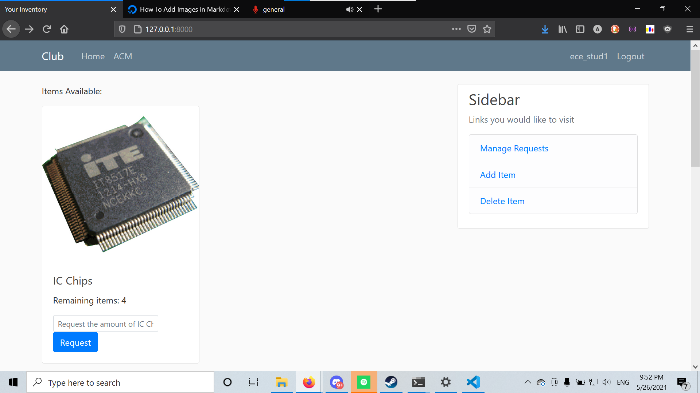
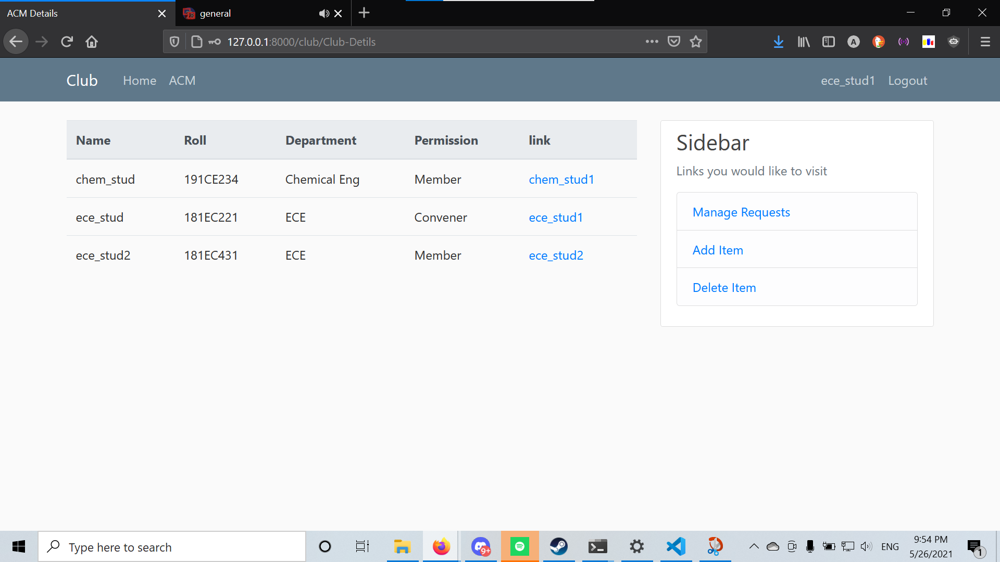

# IRIS Task 1

## Features added

The features of this website is divided into two parts

### 1. Users

1. Each user can register with their valid college credentials and username/password
2. They can login/logout
3. They can check their profile 
4. They can make variable amount of requests for one item
5. They can check their history of requests since their time of registeration
6. Permissions are divided in 3 parts, i.e, admin, conveners, members

### 2. Clubs

1. Each club can have atleast one convener, but there will be a head convener of a club.
2. Each convener of a club can add, delete items from the club inventory
3. Each convener can check the student members of the club and also check their history of requests
4. conveners can also check reject/approve a request of a member while its in pending state.

## Installation and Usage

After cloning the repo

1. Make sure to have python and virtual env installed in the system
2. Run to create venv vritual env
        `python -m venv venv`
3. Activate virtual env to start project
4. run 
        `pip install -r requirements.txt`
5. Change to `IRIS/` dir
6. Run
        `python manage.py makemigrations`
        `python manage.py migrate`
        `python manage.py runserver`
7. This should run on the default `8000` port, open `127.0.0.1:8000` on any browser.

> For admin, redirect to `127.0.0.1:8000/admin/` and enter default credentials `username: admin, password: admin`.

## Bugs/Not completed features

- Not completed the edit feature option in items

## Screenshots

